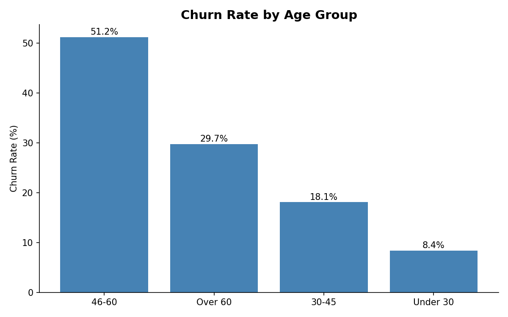
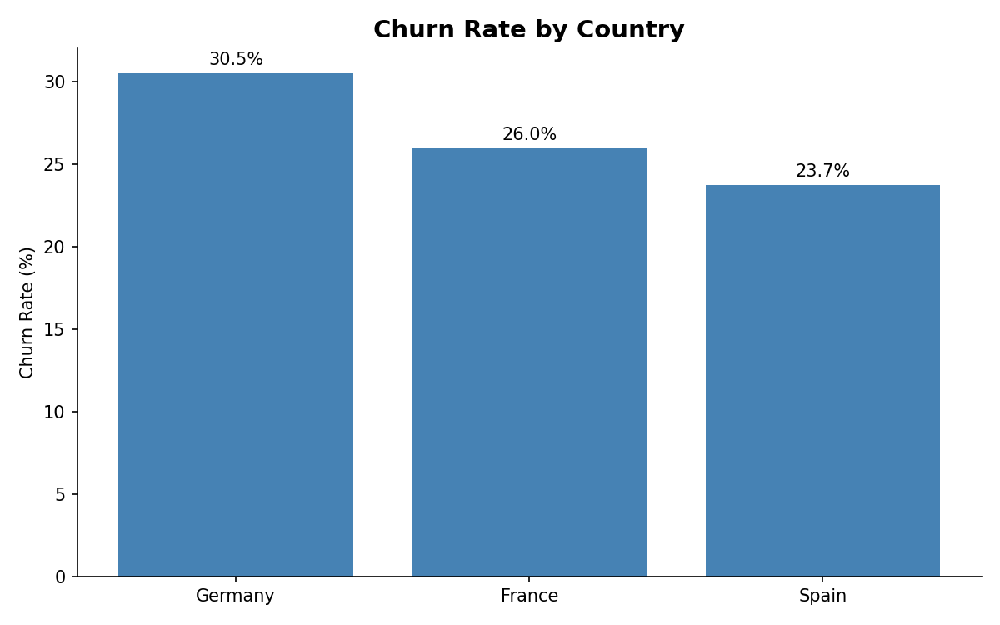
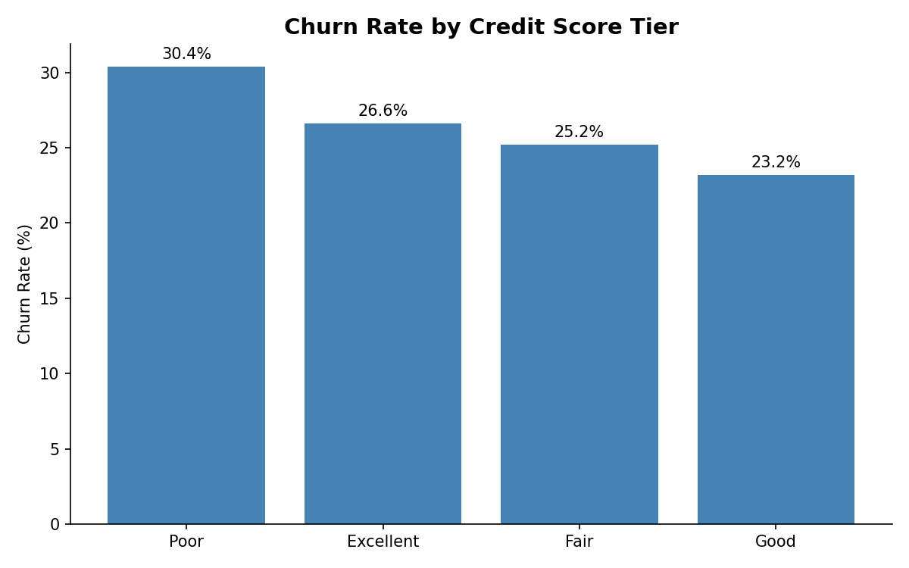
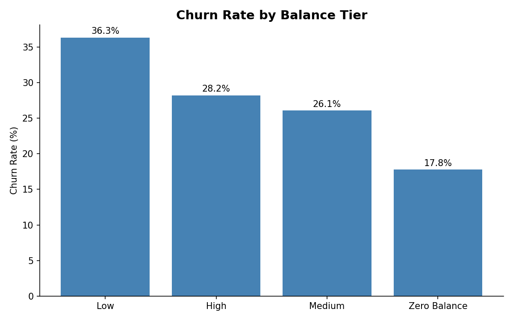
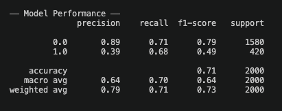
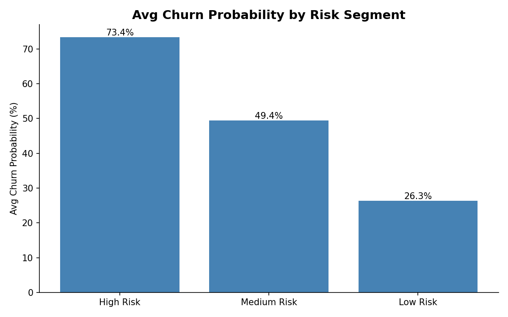

# Bank Customer Churn Analysis

## Business Problem

Customer churn is one of the most critical challenges facing retail banks today. 
Losing a customer is estimated to cost 5–10x more than acquiring a new one, 
making retention a top priority for any financial institution.

This project analyzes churn behavior across 10,000 bank customers to answer 
three core business questions:

1. **Who is churning?** — Identify which customer segments (age, country, credit score, balance) have the highest churn rates
2. **Why are they churning?** — Surface key risk factors driving attrition
3. **Can we predict it?** — Build an ML model to identify at-risk customers early

## Tech Stack
- **BigQuery** — cloud data warehouse
- **dbt** — data modeling & transformation
- **Python** — ML modeling, visualization
  - scikit-learn (Logistic Regression)
  - scipy (Hypothesis Testing)
  - matplotlib (charts)
- **GitHub** — version control

## Dataset
- Source: [Bank Customer Churn Dataset](https://www.kaggle.com/datasets/gauravtopre/bank-customer-churn-dataset)
- 10,000 customers with 12 features including credit score, age, balance, tenure, and churn status

---

## Key Findings

### Churn Rate by Age Group

- Customers aged **46–60 have the highest churn rate at 51.2%** — over half of this segment left the bank
- Under 30 customers show the lowest churn at 8.4%

### Churn Rate by Country

- **Germany has the highest churn rate at 30.5%**, significantly above France (26.0%) and Spain (23.7%)
- This may indicate stronger competition from local German banks

### Churn Rate by Credit Score

- **Poor credit score customers churn most (30.4%)** — likely seeking better terms elsewhere
- **Excellent credit score customers also churn at 26.6%** — likely being poached by competitors

### Churn Rate by Balance Tier

- High balance customers show elevated churn, indicating the bank may be losing its most valuable depositors

---

## Statistical Hypothesis Testing

### Business Question

Are customers aged 46–60 significantly more likely to churn compared to other customers?

### Hypothesis

- **Null Hypothesis (H₀):** Customers aged 46–60 have the same churn rate as other age groups.
- **Alternative Hypothesis (H₁):** Customers aged 46–60 have a significantly higher churn rate than other age groups.

### Statistical Test

A **Chi-Square Test of Independence** was conducted to determine whether churn behavior is significantly associated with customers aged 46–60.

### Result

The test produced a p-value below 0.05, indicating a statistically significant relationship between the 46–60 age segment and churn behavior.

This confirms that customers aged 46–60 are significantly more likely to churn than other customer groups.

### Business Impact

Because middle-aged customers are often financially established and maintain larger banking relationships, this finding supports targeted retention campaigns focused on:

- Personalized outreach
- Competitive lending offers
- Loyalty incentives
- Relationship management programs

This allows the bank to prioritize retention efforts toward a statistically validated high-risk customer segment.

---

## ML Model: Churn Prediction

A **Logistic Regression** model was trained on 8,000 customers and tested on 2,000.

Class imbalance (80/20 split) was addressed using `class_weight='balanced'`, improving churn recall from 15% to 68%.

Customers were segmented into three risk tiers based on predicted churn probability:
- **High Risk**: ≥ 60% churn probability
- **Medium Risk**: 40–60% churn probability
- **Low Risk**: < 40% churn probability

---

## What the Bank Should Do Next

Even though the ML model identifies who is most likely to leave, the next step is to launch targeted retention campaigns instead of broad marketing efforts.

### 1. Prioritize High-Risk Customers

Use the churn prediction model every month to generate a list of high-risk customers. Focus especially on:

- Customers aged **46–60**
- **High-balance** customers
- Customers in **Germany**
- Customers with **very low or very high credit scores**

### 2. Recommended Retention Strategies

#### For High-Balance Customers
- Relationship manager outreach
- Preferred banking benefits
- Reduced fees
- Higher savings/APY offers
- Loyalty rewards

**Goal:** Prevent competitors from attracting premium customers.

#### For Excellent Credit Score Customers
- Competitive loan/mortgage rates
- Personalized offers
- Early renewal incentives
- Premium credit card upgrades

**Goal:** Increase switching cost and improve perceived value.

#### For Poor Credit Score Customers
- Financial wellness programs
- Flexible repayment plans
- Budgeting tools
- Lower minimum balance penalties

**Goal:** Reduce frustration and improve trust.

---

## Conclusion

By combining:

1. **Churn prediction** — identify who will leave before they do
2. **Customer segmentation** — understand why different groups churn
3. **Statistical validation** — confirm high-risk churn patterns are statistically significant
4. **Targeted retention strategies** — act on insights with personalized offers

The bank can move from **reactive retention** to **proactive retention**.

Instead of waiting for customers to leave, the bank can identify at-risk customers early, intervene with personalized offers, and continuously measure which strategies actually reduce churn.

> **Identify who will leave. Target them with the right offer. Measure what works.**