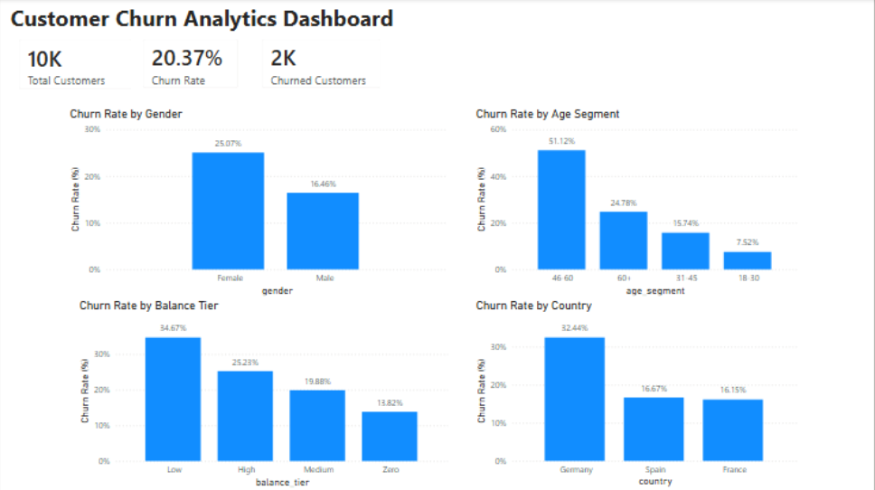
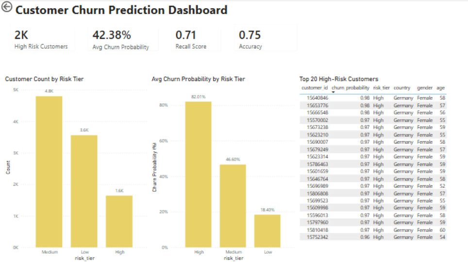

# Customer Churn Prediction & Analytics Dashboard

## Business Problem
Customer churn reduces revenue and customer lifetime value, but traditional reporting only explains why customers left after the fact. The business needed a way to understand historical churn patterns and proactively identify customers at risk of leaving.

## Solution
Developed an end-to-end churn analytics and prediction solution using Google Cloud SQL PostgreSQL, Python, and Power BI.

- Built a cloud data pipeline by migrating raw data from **Google Cloud Storage** to **Google Cloud SQL (PostgreSQL)**, establishing an optimized staging environment.
- Engineered a robust **Analytics Data Mart** within PostgreSQL, applying rigorous type casting and data cleaning to ensure data integrity for downstream modeling.
- Connected Python to Cloud SQL securely using SQLAlchemy and environment variables.
- Built a Logistic Regression model with scikit-learn to predict customer-level churn probability.
- Generated churn probability scores and segmented customers into Low, Medium, and High Risk tiers.
- Saved the final prediction dataset back to PostgreSQL and exported it for Power BI reporting.
- Built Power BI dashboards for historical churn analysis and predictive customer risk segmentation.

## Dataset
- Source: [Bank Customer Churn Dataset](https://www.kaggle.com/datasets/gauravtopre/bank-customer-churn-dataset)
- 10,000 customers with 12 features including credit score, age, balance, tenure, and churn status

---

## Historical Churn Analytics Dashboard
Analyzed historical customer behavior and identified key churn drivers across customer segments.

### Key metrics:
- Total Customers: 10,000
- Churn Rate: 20.37%
- Churned Customers: 2,037

### Key insights:
- Female customers showed higher churn rates than male customers.
- Customers aged 46–60 exhibited the highest churn rate.
- Country and balance-tier segmentation revealed meaningful differences in customer retention behavior.

--- 

## Customer Churn Prediction Dashboard
Built a Logistic Regression model to estimate customer-level churn probability.

### Process:
- Retrieved clean data from the PostgreSQL Analytics Mart.
- Applied feature engineering and one-hot encoding.
- Trained a Logistic Regression model using demographic, financial, and engagement features.
- Generated churn probability scores for all customers.
- Segmented customers into Low, Medium, and High Risk tiers.

### Model Performance:
- **Recall Score: 71.3%** *(Optimized to minimize False Negatives, ensuring max coverage of actual at-risk customers)*
- Accuracy: 75.0%
- Average Churn Probability: 42.4%
- High-Risk Customers Identified: ~2,000

---

## Business Impact
This solution transformed churn analysis from descriptive reporting into predictive decision support.

By identifying approximately 2,000 high-risk customers and ranking them by churn probability, business teams can prioritize retention campaigns, allocate resources more effectively, and intervene before customers leave.