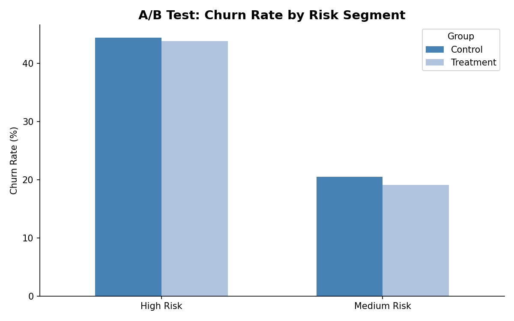
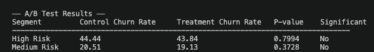

# Bank Customer Churn Analysis

## Business Problem

Customer churn is one of the most critical challenges facing retail banks today. 
Losing a customer is estimated to cost 5–10x more than acquiring a new one, 
making retention a top priority for any financial institution.

This project analyzes churn behavior across 10,000 bank customers to answer 
three core business questions:

1. **Who is churning?** — Identify which customer segments (age, country, 
   credit score, balance) have the highest churn rates
2. **Why are they churning?** — Surface key risk factors driving attrition
3. **Can we predict and prevent it?** — Build an ML model to identify 
   at-risk customers early, and simulate a retention intervention using A/B testing

The ultimate goal is to help the bank proactively target high-risk customers 
with retention offers before they leave, reducing revenue loss and improving 
customer lifetime value.

## Tech Stack
- **BigQuery** — cloud data warehouse
- **dbt** — data modeling & transformation (staging + marts)
- **Python** — ML modeling, A/B testing, visualization
  - scikit-learn (Logistic Regression)
  - scipy (chi-square test)
  - matplotlib (charts)
- **GitHub** — version control

## Dataset
- Source: [Bank Customer Churn Dataset](https://www.kaggle.com/datasets/gauravtopre/bank-customer-churn-dataset)
- 10,000 customers with 12 features including credit score, age, balance, tenure, and churn status

---

## Key Findings

### 1. Who is churning?

- Customers aged **46–60 have the highest churn rate at 51.2%** — over half of this segment left the bank
- Under 30 customers show the lowest churn at 8.4%, suggesting younger customers are more loyal or less financially mobile

- **Germany has the highest churn rate at 30.5%**, significantly above France (26.0%) and Spain (23.7%)
- This may indicate stronger competition from local German banks or dissatisfaction with product offerings in that market

- **Poor credit score customers churn most (30.4%)**, which is expected — these customers may be seeking better terms elsewhere
- Notably, **Excellent credit score customers also churn at 26.6%**, suggesting high-value customers are being poached by competitors offering better rates

- High balance customers show elevated churn, indicating the bank may be losing its most valuable depositors

---

## ML Model: Churn Prediction

A **Logistic Regression** model was trained on 8,000 customers and tested on 2,000 to predict individual churn probability.

Class imbalance (80/20 split) was addressed using `class_weight='balanced'`, improving churn recall from 15% to 68%.

Customers were segmented into three risk tiers based on predicted churn probability:
- **High Risk**: ≥ 60% churn probability
- **Medium Risk**: 40–60% churn probability  
- **Low Risk**: < 40% churn probability

---

## A/B Test: Retention Intervention Simulation

High and Medium Risk customers were randomly assigned to Control and Treatment groups to simulate a retention offer intervention.

**Note:** No statistically significant difference was found between groups (p > 0.05). This is expected in a simulated environment where no actual intervention was applied. In a production setting, the Treatment group would receive real retention offers (e.g. fee waivers, preferential rates), and churn outcomes would be measured over 90 days.

---

## What the Bank Should Do Next

Even though the initial A/B test did not show a statistically significant improvement, 
the churn analysis and ML model clearly identified who is most likely to leave. 
That means the next step is to launch targeted retention campaigns instead of 
broad marketing efforts.

### 1. Prioritize High-Risk Customers

Use the churn prediction model every month to generate a list of high-risk customers.
Focus especially on:

- Customers aged **46–60**
- **High-balance** customers
- Customers in **Germany**
- Customers with **very low or very high credit scores**

These customers represent the highest potential revenue loss.

---

### 2. Recommended Retention Strategies

#### For High-Balance Customers
These customers are valuable, so retention cost is justified.

- Relationship manager outreach
- Preferred banking benefits
- Reduced fees
- Higher savings/APY offers
- Loyalty rewards

**Goal:** Prevent competitors from attracting premium customers.

#### For Excellent Credit Score Customers
These customers may churn because they receive better offers elsewhere.

- Competitive loan/mortgage rates
- Personalized offers
- Early renewal incentives
- Premium credit card upgrades

**Goal:** Increase switching cost and improve perceived value.

#### For Poor Credit Score Customers
These customers may leave because of financial stress or dissatisfaction.

- Financial wellness programs
- Flexible repayment plans
- Budgeting tools
- Lower minimum balance penalties

**Goal:** Reduce frustration and improve trust.

---

### 3. Improve the A/B Testing Process

The current test is useful because it validates the experimentation pipeline.
Next improvements:

- Run the test longer (e.g., 90+ days)
- Use real interventions instead of simulated treatment
- Increase sample size
- Segment tests by customer type instead of testing everyone together

For example:
- Test fee waivers only on high-balance customers
- Test loan discounts only on excellent-credit customers

This usually produces stronger measurable effects.

---

## Conclusion

By combining:

1. **Churn prediction** — identify who will leave before they do
2. **Customer segmentation** — understand why different groups churn
3. **Targeted A/B testing** — measure which retention strategies actually work

The bank can move from **reactive retention** to **proactive retention**.

Instead of waiting for customers to leave, the bank can identify at-risk customers 
early, intervene with personalized offers, and continuously measure which strategies 
actually reduce churn.

> **Identify who will leave. Target them with the right offer. Measure what works.**